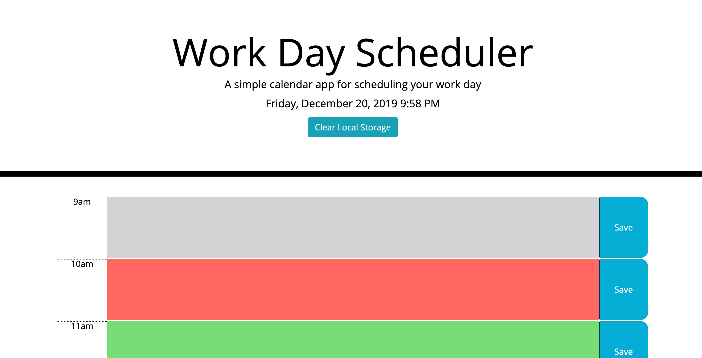

# Unit 05 Third-Party APIs Homework: Day Planner

https://n0matic.github.io/Day.Planner.io/ 

S AN employee with a busy schedule

I WANT to add important events to a daily planner

SO THAT I can manage my time effectively 

# Assignment:

Create a simple calendar application that allows the user to save events for each hour of the day. This app will run in the browser and feature dynamically updated HTML and CSS powered by jQuery.

# Functionality:

The app displays timeslots in standard business hours (9 a.m. to 5 p.m.). Each time slot represents one hour.

Clicking on the save button will store the time and user input in Local Storage.

## Screenshot:

## Created with:

https://momentjs.com
https://getbootstrap.com
